# DeepVM Memory Management

[TOC]

## Design Target

DeepVM has a management design based on memory pool. It tries to reduce the requirement of memory allocation requests and the delay of memory release, as well as reduce memory fragmentation.

- Support setting memory pool size on initialisation;
- Support fast allocation and release of memory blocks;
- Support destroy of memory pool;
- Support real time prints of memory usage;
- Do not support dynamic resizing of memory pool;

### Key Target

- Ensure the availability and usability of the memory pool in long term as long as the hardware is reliable.

#### Tradeoffs

- **Single-thread only**: eliminates the overheads from synchronisation mechanisms.
- For limited memory contexts mainly like IoT: the upper limit of a single memory pool is **4 GiB** (32-bit memory addressing with byte unit)
- 32-bit addressing only for now
- **No read/write authorisation verification**, which is left for the VM and language implementation

### Note

- Who should manage the memory: the memory management algorithm only manage the unallocated memory blocks. In the lifecycle of a block, the duty of managing the block is transferred to the upper applications via `deep_malloc`, and is transferred back to the management module by the VM via call `deep_free`.
  - Thus, *Fast Block*, *Sorted Block*, and *Remainder Block* specified below are all a specialisation of a *Free Block*.
- *Naked Address* (naked pointer): the naked address is directly exposed to other modules in the VM. The usage of memory and addresses is controlled by the VM in syntax and semantics level. Due to the radical nature of memory management algorithms, the application should never assume the absolute address of any memory block and/or the relative positions between the blocks.

## Data Structures of the Memory Pool

The basic unit of the memory pool is memory block (block), with 2 states: **Used/Allocated**, and **Unused/Free**.

### Allocated Block

*Allocated block* consists of 3 parts: *head*, *payload*, and an optional *padding*。

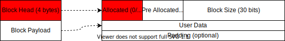

- *head* saves the meta-data of the whole *block*. The meta-data is **private**, and should only be read/write by the memory management APIs.
- *payload* can be **directly** used by the externals (naked memory), and is permitted to be read from/written to directly.
- *padding* (optional) is used to fill in the remaining to ensure the memory blocks are correctly aligned.

| Members in the *block head*          | Purpose                                                      |
| ------------------------------------ | ------------------------------------------------------------ |
| [a] allocated (1 bit)                | Indicating the usage of the block (Should be `1` here)       |
| [p] previous block allocated (1 bit) | Indicating if the previous block is used (preceding in absolute address) |
| [size] block size (30 bits)          | Save the size of head + payload in bytes.                    |

### Free Block

*Free block* does not have *payload* compared with *allocated block*. However, it has a *predecessor* and *successor* pointers usually, with an extra *footer*.

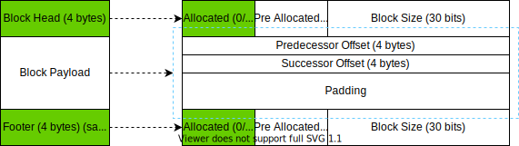

- Head and *footer* store the meta-data of the block, with **exactly same content** (bitwise equal), and are placed on the two ends of the block (the first and last 4 bytes)
- Predecessor and *successor* are arranged in order, next to the *head*, taking (the part of) memory space that was designated to *payload*, storing the **signed offset** to the starting addresses of the precursor and the successor free block respectively (i.e., the offset between the starting address of the current block to the head of the corresponding block). With these offsets, a bidirectional linked-list is formed logically, which is utilised by *bins* and relevant algorithms
- All remaining spaces are treated as *padding*. The value insides are **undefined**, which may or may not be used by the memory management systems

### Special Memory Block: Remainder Block

During the initialisation, there is only one *free block* in the pool, which is managed directly by the pointer *Remainder Block*. Only 2 indicator in the *head* bits are defined.

Noticed that the block head in the remainder block should be guaranteed to have 4 bytes. The payload can be as small as 0 byte. There should always be a remainder block.

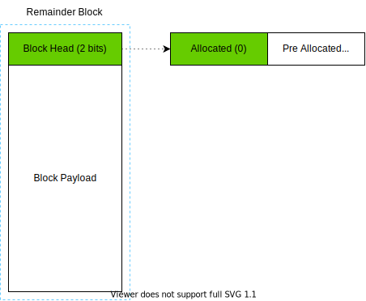

- *allocated* should be 0
- When *remainder block* is the first block in the memory, *pre allocated* should be `1`. Otherwise, it should be set according to the preceding block next to it
  - In reality, `P` is always `1` due to the merging mechanism

## Memory Recycling Acceleration Mechanism: Bins

### Fast Bins: Allocating Small Chunks Fast

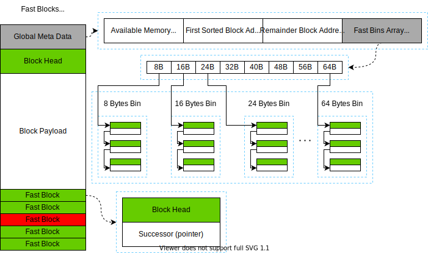

A map is created in the first part of the memory pool during initialisation, which is used to accelerate memory recycling.

Each *fast bin* is a *LIFO* unidirectional linked list (a *stack*, logically), storing *free blocks* of same sizes, named *fast blocks*.

In order to allocating them fast, all *fast blocks* will not be merged even if they are free usually. Other mechanisms may be introduced to merge and recycle them together.

Note that *fast blocks* do not contains *predecessor pointer* and *footer* since all blocks in a chain has same size, and the linked list can only be traversed in one direction. The smallest block is 8 bytes considering the requirement of a 4-byte head and an address pointing to another block (4-byte successor pointer). To simplify the implementation, *fast bins* uses pointers with absolute address rather than offsets.

These *bin*s are considered to be implemented[^1]：

| Fast Bin Size (4 bytes head +  n bytes payload + padding) | Use cases                                                    |
| --------------------------------------------------------- | ------------------------------------------------------------ |
| 8 bytes (4 + 4)                                           | Most internal datatypes (`char` / unicode char, `bool`, `int32_t`, single precision floating number) |
| 16 bytes (4 + 12)                                         | Some augmented internal datatypes (`int64_t`, double precision floating number) |
| 24 bytes (4 + 20)                                         | Some small complex structures (`string` under 20 bytes, function table with less than 5 entries) |
| 32 bytes (4 + 28)                                         | Some small complex structure部分小型复合结构                 |
| 40 bytes (4 + 36)                                         | Math Lib: Octonion                                           |
| 48 bytes (4 + 44)                                         | Other data structures. (to keep *sorted bins* efficient mainly) |
| 56 bytes (4 + 52)                                         | Same as above                                                |
| 64 bytes (4 + 60)                                         | Same as above, and for 8 bytes alignment constraint          |

[^1]: Only there common use cases are proposed for now.

### Other Free Memory Management: Sorted Bins

Manages all blocks that *fast bins* failed to manage (all free blocks $\gt$72 bytes under the current design). These blocks are named *sorted blocks*.

*Sorted Bins* supports partial allocation in `deep_malloc`, and allows merging with neighbours during `deep_free`. It does not prioritise time efficiency in its implementation.

A data structure of Skip List with nested bidirectional linked list is used. The time complexity is logarithm-level without extra space consumption.

#### The Structure of Sorted Block

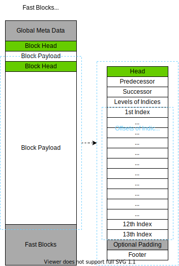

- Four fields *head*, *predecessor*, *successor*, *footer* (12 + 4 bytes in total) which are compatible with the design of free blocks described beforehand
  - Specially, *predecessor* and *successor* points to a *sorted block* with **exact same size**, and thus form a *sorted bin*, where every block in this bidirectional linked list has same size
- Setting 14 fields (4 + 52 bytes) in the *padding* area to store the meta-data required by the algorithm
  - The first field stores the level of indices built in this block
  - The remaining 13 fields points to the next block in the chain of the same **index level**. This value is undefined if the corresponding level of index is not built in this block. If this block is the last block in this level of index, then it will point to itself.
    - Higher level of index (smaller the number) will skip more nodes usually, having a smaller chain
    - Smaller level will be stored closer to the head

### Design of the Skip List

Link all sorted bin in **ascending order** by the size of the first block in each *sorted bin*. Every *bin* has some level of indices built (1-13 inclusive, randomised level), with meta-data filled in order in the corresponding fields (17th-68th bytes) of every first block of each sorted bin. The implementation in Redis is a good reference[^2]. The 13th level of index (the lowest level) will thus form a unidirectional linked list that directly links the **head block**s of sorted bins of **different sizes**.

#### Parameter Details

- The number of indexing nodes can be calculated as `/ 5`, with at most 5 nodes in the highest level
- The node of same size can be directly added to the corresponding head of the linked list (cf. linked list method used for resolving conflicts in hash table), forming a FILO linked list.
  - An optimisation: always insert as the second block to avoid reconstruct index
- The time complexity is about $O(\log_5{n})$ With a constant $\leq 5$ when the memory is below 4 GiB. In the worst scenario, the number of indexing nodes traversed should be below 60.

[^2]: Please refer to the reference in the end of this document

## Global Meta-data

96 bytes in total.

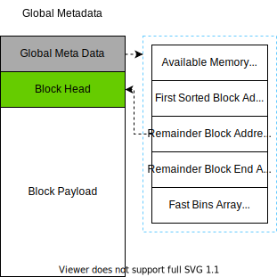

### Global Free Memory

8 bytes. Stores the global free memory solely (as an optimisation in single-threaded system), changed during `deep_malloc` and `deep_free`.

### Address of the First Sorted Block / Address of the First Block in the Skip List

8 bytes. The address to the smallest sorted block. It points to a fake sorted block of 72 bytes by default, which is used as the head of all indices.

### Address of the Remainder Block

8 bytes. The address of the last free block, which is used for additional operations.

### End address of the Remainder Block

8 bytes. The address of the next byte of the end part of the last free block, which is used for additional operations.

### Fast Bins Array

$8 \times 8 \textrm{ bytes} = 64 \textrm{ bytes}$. Store the address of the first element in each bin of the fast bins in order. An empty bin head always points to itself.

## Memory Pool Management Procedure

The minimum unit to be managed is *block*. Each `deep_malloc` creates a new `block` if not reusing; each `deep_free` may destroy one or more blocks. Initialisation is required before using the memory pool, which is done by `deep_mem_init`.

### deep_mem_init

#### Parameter List

1. The size available to the memory pool n` (Bytes)
2. The pointer $p$ to the memory address acquired by the system. $[p, p+n)$ should be available with RW permission.

#### Procedure

Assuming indexing by bytes and listen-endian.

1. Use OS provided (or if in a naked chip, manually set) contiguous memory of `n` bytes, save its head address as `addr`
2. Set global free memory as `n - 172` (the first 8 bytes at `addr`)
3. Set the address of the first block of the skip list as `addr + 96` (the 8 bytes at `addr + 8`)
4. Initialise the first block of the skip list `addr + 96 – addr + 167`
   1. Set `head` as `0`, i.e., `A`/`P` flags both as `0`, and `block size = 0` (minimum) to prevent being allocated
   2. Set all offsets as `0`
   3. Set the level of indices to the maximum `13`

5. Set the head address of the *remainder block* as `addr + 168` (the 8 bytes at `addr + 16`)
6. Set the head address of the *remainder block* as `addr + n` (the 8 bytes at `addr + 24`)
7. Set the *fast bin array* as `NULL`, 8 bytes per group, 64 bytes in total from `addr + 32` to `addr + 95`
8. Initialise the head of the remainder block (from `addr + 168` to `addr + 171`)
   1. Let `m` be the size of the payload of the remainder block, i.e., `m = n - 100`
   2. Left shift `m` by 2 bits, and set the last 2 empty bits ad 0, 1 respectively from low-end to high-end
   3. Example code (C/C++): `*((int *)(addr + 96)) = ((n - 100) << 2) & 2`

9. The result of the initialisation should be as followed

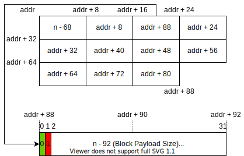

### deep_malloc

1. Check if there is enough free memory available according to the *global free memory*; if not, returns failure
1. Check whether the memory required is managed by *fast bins* or *sorted bins*. The threshold is `72 bytes` in current design: if `n >= 72bytes` then it is managed by sorted bins; the following procedure is described as followed
2. If there is no enough continuous free memory available, returns failure (or consider memory defragmentation, TBD)

#### Fast Bin

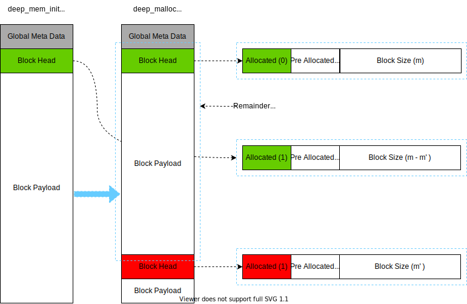

1. Calculate offsets, check if there is available fast block in fast bin directly.
2. If exists, remote the corresponding list head element, go to step 4
   - Update the *successor* pointer in this fast block so it will point to its successor; if it is the last block already, set it as `NULL`
3. If not exists, cut out a free block with required size at the end address of the remainder block; update the end address of the remainder block.
4. Update *Global Free Memory*.
5. Initialise the fast block that is going to be returned.
6. Returns the address to the *payload* in this block.
   - Update *block head*: set* *allocated* flag as `1`, *pre-allocated* as `1`, *block size* as the size of the payload (in Bytes)

Note: Clustering all fast blocks that has smaller size at the end of the memory pool is to prevent sorted blocks from being split, thus ensuring sorted blocks can be merged as far as possible. This is considered as a method of separating fragmentations.

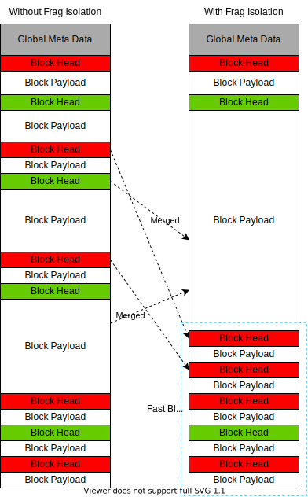

#### Sorted Bin

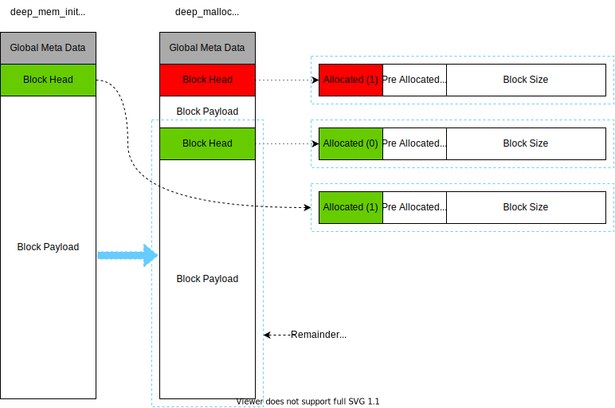

1. Find a sorted block with `size == n`
2. If exist, initialise this block, go to step 5
   1. Update *head*, set *allocated* flag as `1`
   1. Update the *pre allocated* flag as `1` of the block that is next to this block in terms of physical address
3. If not exist, find the minimum sorted block where `size >= 72 + n`  from the skip list
4. Split the first `n` bytes from this block and returns; convert the remaining as a sorted block as insert into the skip list
   1. Update the data of this block
      1. Initialise *head*, filling *block size*, update *allocated* flag, keep *pre allocated* flag unchanged
      2. Remove this block from the skip list. Ensure the indices and pointers for the bidirectional linked list are all updated
   2. Initialise the remaining spaces
      1. Initialise *head*, set *allocated* flag as `0`, *pre allocated* flag as `1`, set *block size*
      1. Insert it back into the skip list, and update the indices and offsets accordingly
      2. Set *footer*, copying all values from *head*
5. Update *Global Free Memory*; update the address of the remainder block if necessary
6. Return the address of the payload of the initialised block

### deep_free

First check whether the memory block to be released should be managed by *fast bin* or *sorted bin*. The threshold is 72 bytes under the current design.

#### Fast Bin

1. Initialise *fast block*
1. Calculate offsets, insert the fast block into the corresponding fast bin as the head element (thus the first candidate to be reused)
2. Update *Global Free Memory*

#### Sorted Bin

1. Check if the neighbourhood free blocks are available to be merged in both up and down directions. If yes, then conducting the merge process
1. Initialise *sorted block*
3. Insert it into the skip list of *sorted bin*s
   - If have sorted block with same size: insert into the **second** position of the bidirectional linked list of that sorted bin (prevent copying / reconstruct indices)
   - Otherwise, insert as a head node of a new sorted bin, and add a random levels $[1, 13]$ of indices
4. Update *Global Free Memory*; update the address to the remainder block if necessary

##### Merge Consecutive Green Blocks

Special procedure when releasing sorted blocks to merge neighbour available blocks.

1. Check the `[p]` flag in the header of the current block. If the previous block is a free block, then scan upwards; otherwise, go to step 3
1. Check `[size]` in the previous block's footer to compute the head address of the block; set this block as the current block, repeat stop 1
2. Compute the head address of the next block via the `size` and head address of the current block. Check its `[a]` flag. If it is free, then set it as the current block, and repeat step 3
2. Merge all spaces between the top block scanned from step 1-2 and the last block scanned via step 3, re-initialised as a free block (sorted block)

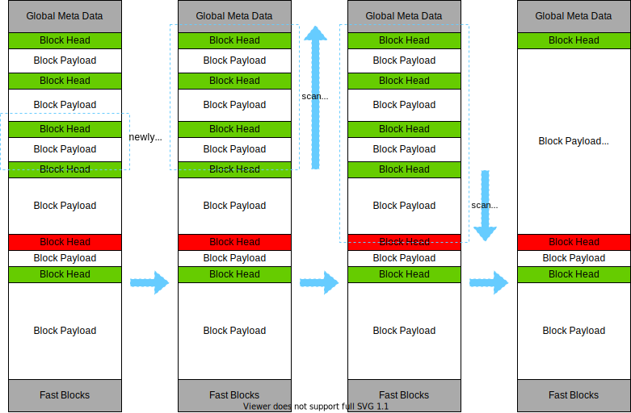

Note that since merging is conducted every time, usually at most 3 blocks can be marked for merging.

## Q & A with Supervisor

1. Which level does this module work at? Should it interact with lower modules, or it is the lowest module itself?
   - It should work as a part of the VM, like a driver in the embedded systems
   - It is the lowest module in memory management
   - It depends on the OS, where it can acquire a huge chunk of memory from
2. Should it manage RW permissions?
   - This can be managed in semantics level. Thus this can be ignored by the memory management system
## Possible Global Defragmentation Methods (TBD)

Conducting global data movements when the *Global Free Memory* is enough but no continuous free memory is big enough. TBD.

## References

### glibc Heap Management

[Linux堆内存管理深入分析（上）](https://introspelliam.github.io/2017/09/10/Linux堆内存管理深入分析（上）/)

[Linux堆内存管理深入分析下](https://introspelliam.github.io/2017/09/15/pwn/Linux堆内存管理深入分析下/)

### Skip List

[Skip List--跳表（全网最详细的跳表文章没有之一）](https://www.jianshu.com/p/9d8296562806)

[Redis/.../t_zset (Implementation of Skip-List)](https://github.com/antirez/redis/blob/unstable/src/t_zset.c)
